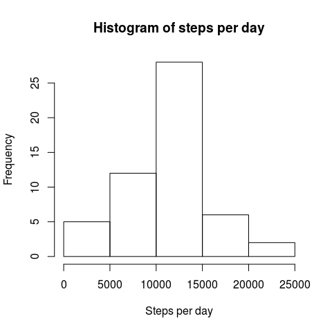
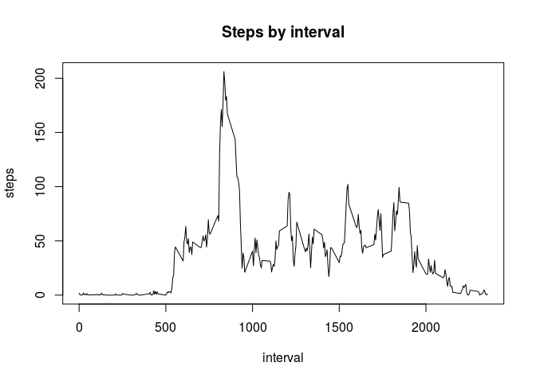
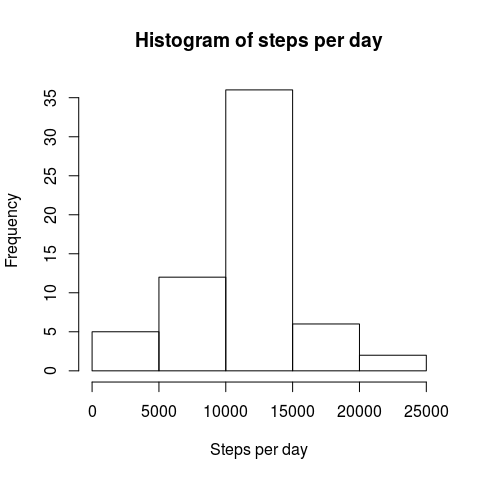
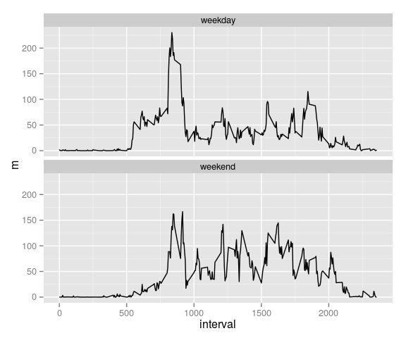

# Reproducible Research: Peer Assessment 1
Eric Vaitl  

## Loading and preprocessing the data

> Show any code that is needed to

> 1. Load the data

> 2. Process/transform the data.

I check to see if I already have the file. If I don't have it I use 
download.file() to fetch it. 

Once we know we have the data file, we can use read.table() to 
load it: 


```r
# Fetch and load data, with minimal processing. 
load_data <- function() {
    # Where we get data from 
    url<-'https://d396qusza40orc.cloudfront.net/repdata%2Fdata%2Factivity.zip'
    # Local file name
    zipname<-'activity.zip'
    # Unzipped data
    csvname<-'activity.csv'
    # If file isn't cached locally, get it. 
    if(!file.exists(csvname)){
        download.file(url,zipname)
        unzip(zipname)
    }
    # Load and return data. Use colClasses to coerce column types. 
    read.table(csvname, header=TRUE, sep=',',colClasses=c('numeric','Date','numeric'))
}
df<-load_data()
```

## What is mean total number of steps taken per day?

> For this part of the assignment, you can ignore the missing values in the
> dataset. 

> 1. Make a histogram of the total number of steps taken each day.  

> 2. Calculate and report the mean and median total number of steps per day. 

A simple way to get the steps per day is to use aggregate(): 


```r
af<-aggregate(steps~date,data=df,sum)
mn<-paste(round(mean(af$steps)))
md<-paste(median(af$steps))
```
Here is the histogram using base graphics:


```r
hist(af$steps,xlab='Steps per day',main='Histogram of steps per day')
```

 

The mean number of steps per day is 10766. The 
median number of steps per day is 10765.

I'm using paste() in the code to clean up the formatting of the 
results of mean() and median(). If I don't do that I end up with ugly 
formatting for the numbers. 

## What is the average daily activity pattern?

> 1. Make a time series plot of the 5-minute intervale and the average number
> of steps taken, averaged across all days. 


```r
d2<-aggregate(steps~interval,data=df,mean)
plot(d2,type='l',main='Steps by interval')
```

 

> 2. Which 5-minute interval, on average across all the days of the dataset, 
> contains the maximum number of steps?


That would be d2\$interval[which.max(d2$steps)]: 835. 

## Imputing missing values

This section is about imputing missing values. 

> 1. Calculate and report total number of missing values in the data set. 

There are 2304 missing steps, 0 missing dates, and 0 missing intervals. 

> 2. Devise a strategy for filling in all of the missing values in the dataset. 

> 3. Create a new dataset that is equal to the original dataset but with the missing
> data filled in. 

Just some steps are missing. I'll fill in with mean across days for the same
interval. We have already calculated that and stored it in d2$steps. The 
easiest way I can think of to do the assignment is to just use a rep() on 
d2 to get the lengths of the vectors to match and then assign with a 
logical vector selector for the NA values: 


```r
df2 <- df
df2$steps[is.na(df2$steps[]) ] <- rep(d2$steps,61)[is.na(df2$steps)]
```

The new data set is df2. 

> 4. Make a histogram. Calculate and report mean and median. Do these values
> differ from the first part of the assignment?


Same code as above: 


```r
af2<-aggregate(steps~date,data=df2,sum)
mn2<-paste(round(mean(af2$steps)))
md2<-paste(round(median(af2$steps)))
```
Here is the histogram using base graphics:


```r
hist(af2$steps,xlab='Steps per day',main='Histogram of steps per day')
```

 

The mean number of steps per day is now 10766. The median number of steps
per day is now 10766.  The changes are very minimal. The median is no 
longer a round number because it appears to have picked up one of the means
that was used for imputation. 

## Are there differences in activity patterns between weekdays and weekends?

> 1. Create a new factor variable in the dataset with two levels "weekday" 
>  and "weekend". 

> 2. Make a panel plot containing time series plots of weekdays and weekends. 


I'll use the imputed data set (df2) for this. 

The panel plot seems a lot easier with dplr and ggplot2: 


```r
# Add the new factor
df2<-cbind(df2, sapply(weekdays(df2$date), 
                       function(d){ 
                           if(d=='Sunday' || d=='Saturday') 
                               return("weekend"); 
                           "weekday" }))
# Change column name to something reasonable
colnames(df2)[4]<-'wd'
library(dplyr)
library(ggplot2)
# group, summarize, panel line plot by facet. 
df2 %>% group_by(wd,interval) %>% summarize(m=mean(steps)) %>% 
    ggplot(aes(x=interval, y=m))+geom_line()+facet_wrap(~wd,ncol=1)
```

 

There are significant differences between weekday and weekend activity. 

